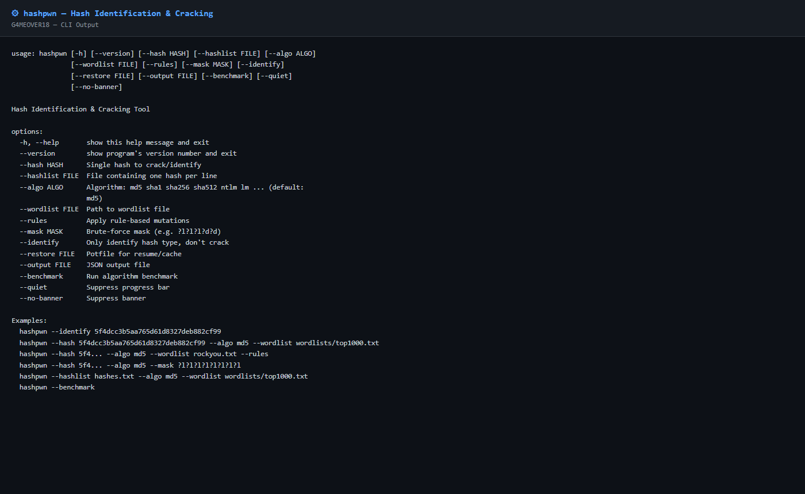

# hashpwn

**Hash-Identifikations- und Cracking-Tool für Security-Researcher**

Reines Python-Stdlib-Tool, inspiriert von:
- **[hashcat](https://github.com/hashcat/hashcat)** — die Industrie-Standard Hash-Cracking-Engine (props: atom & team)
- **[hashID](https://github.com/psypanda/hashID)** — automatische Hash-Erkennung (props: psypanda)

> Dieses Tool ersetzt keine dieser Projekte — es dient als leichtgewichtiges,
> abhängigkeitsfreies Python-Werkzeug für schnelle Analysen ohne GPU-Support.

---

## Features

- Automatische Hash-Erkennung (35+ Typen via Regex)
- Dictionary-Angriff (MD5, SHA1, SHA256, SHA512, NTLM, LM, BLAKE2, …)
- Regelbasierte Mutationen (Leet, Jahresanhänge, Suffixe, Groß-/Kleinschreibung)
- Maskenangriff (`?l ?u ?d ?s ?a`)
- Hashlist-Modus (mehrere Hashes auf einmal cracken)
- Potfile-kompatible Ausgabe (`hash:plain`)
- JSON-Export (`--output`)
- Live-Progressbar mit ETA und H/s
- Benchmark-Modus

---

## Unterstützte Hash-Typen (Identifikation)

| # | Name | Länge / Prefix |
|---|------|----------------|
| 1 | MD5 | 32 Hex |
| 2 | SHA-1 | 40 Hex |
| 3 | SHA-224 | 56 Hex |
| 4 | SHA-256 | 64 Hex |
| 5 | SHA-384 | 96 Hex |
| 6 | SHA-512 | 128 Hex |
| 7 | SHA3-224 | 56 Hex |
| 8 | SHA3-256 | 64 Hex |
| 9 | SHA3-384 | 96 Hex |
| 10 | SHA3-512 | 128 Hex |
| 11 | RIPEMD-160 | 40 Hex |
| 12 | BLAKE2b-512 | 128 Hex |
| 13 | BLAKE2s-256 | 64 Hex |
| 14 | NTLM | 32 Hex |
| 15 | LM | 32 Hex |
| 16 | bcrypt 2a | `$2a$` |
| 17 | bcrypt 2b | `$2b$` |
| 18 | bcrypt 2y | `$2y$` |
| 19 | argon2id | `$argon2id$` |
| 20 | argon2i | `$argon2i$` |
| 21 | argon2d | `$argon2d$` |
| 22 | scrypt | `$scrypt$` |
| 23 | md5crypt | `$1$` |
| 24 | sha512crypt | `$6$` |
| 25 | sha256crypt | `$5$` |
| 26 | apr1 (Apache MD5) | `$apr1$` |
| 27 | PBKDF2-SHA256 (Django) | `pbkdf2_sha256$` |
| 28 | PBKDF2-SHA1 (Django) | `pbkdf2_sha1$` |
| 29 | PHPass (WordPress) | `$P$` |
| 30 | PHPass (phpBB3) | `$H$` |
| 31 | Drupal7 | `$S$` |
| 32 | MySQL 3.23 | 16 Hex |
| 33 | MySQL 4.1+ | `*` + 40 Hex |
| 34 | PostgreSQL MD5 | `md5` + 32 Hex |
| 35 | Oracle 11g SHA1 | `S:` + 60 Hex |
| 36 | MSSQL 2000/2005 | `0x0100` + 88 Hex |
| 37 | MSSQL 2012/2014 | `0x0200` + 136 Hex |
| 38 | Cisco Type 7 | `07` + hex |
| 39 | Kerberos 5 TGT | `$krb5tgs$` |
| 40 | Kerberos 5 AS-REP | `$krb5asrep$` |
| 41 | SAP CODVN G | `{x-issha,` |
| 42 | WPA-PSK | 64 Hex |
| 43 | CRC32 | 8 Hex |

---

## Installation

Nur Python 3.7+ benötigt, **keine externen Abhängigkeiten**.

```bash
git clone https://github.com/G4MEOVER18/hashpwn
cd hashpwn
python hashpwn.py --help
```

---

## Verwendung

### Hash identifizieren

```bash
python hashpwn.py --identify --hash 5f4dcc3b5aa765d61d8327deb882cf99
```

Ausgabe:
```
[*] Possible hash types for: 5f4dcc3b5aa765d61d8327deb882cf99
    - NTLM
    - MD5
```

---

### Dictionary-Angriff

```bash
python hashpwn.py --hash 5f4dcc3b5aa765d61d8327deb882cf99 \
                  --algo md5 \
                  --wordlist wordlists/top1000.txt
```

Mit Rockyou (großes Wordlist):
```bash
python hashpwn.py --hash 5f4dcc3b5aa765d61d8327deb882cf99 \
                  --algo md5 \
                  --wordlist /usr/share/wordlists/rockyou.txt
```

---

### Regelbasierte Mutationen

```bash
python hashpwn.py --hash <HASH> --algo sha256 \
                  --wordlist wordlists/top1000.txt --rules
```

Angewandte Regeln:
- Großschreibung (capitalize, upper, lower)
- Leet-Substitution (`a→4, e→3, i→1, o→0, s→5`)
- Jahresanhänge 2020–2026
- Suffixe: `!`, `123`, `@`, `#`, `1234` …
- Umkehren (reverse)
- Verdoppeln (word+word)

---

### Maskenangriff (Brute-Force)

```bash
# 6-stellige Kleinbuchstaben
python hashpwn.py --hash <HASH> --algo md5 --mask "?l?l?l?l?l?l"

# 4 Kleinbuchstaben + 2 Ziffern
python hashpwn.py --hash <HASH> --algo sha1 --mask "?l?l?l?l?d?d"

# Literale gemischt mit Charsets
python hashpwn.py --hash <HASH> --algo ntlm --mask "Admin?d?d?d?d"
```

Mask-Tokens:
| Token | Zeichensatz |
|-------|-------------|
| `?l` | a-z (26) |
| `?u` | A-Z (26) |
| `?d` | 0-9 (10) |
| `?s` | Sonderzeichen |
| `?a` | alle druckbaren |

---

### Mehrere Hashes (Hashlist)

```bash
# hashes.txt enthält einen Hash pro Zeile
python hashpwn.py --hashlist hashes.txt \
                  --algo md5 \
                  --wordlist wordlists/top1000.txt
```

Mit Regeln:
```bash
python hashpwn.py --hashlist hashes.txt --algo sha1 \
                  --wordlist wordlists/top1000.txt --rules
```

---

### Benchmark

```bash
python hashpwn.py --benchmark
```

Beispielausgabe:
```
[*] Benchmarking 11 algorithms for 3s each...

  md5            1,234,567 H/s  ########################################
  sha1             987,654 H/s  ################################
  sha256           654,321 H/s  ####################
  sha512           432,109 H/s  #############
  ...
```

---

### Potfile (Resume / Cache)

Gecrackte Hashes werden automatisch in `hashpwn.pot` gespeichert.  
Beim nächsten Aufruf wird der Cache geprüft — bereits gecrackte Hashes
werden sofort zurückgegeben.

```bash
# Eigene Potfile angeben
python hashpwn.py --hash <HASH> --algo md5 \
                  --wordlist wordlists/top1000.txt \
                  --restore meine.pot
```

---

### JSON-Export

```bash
python hashpwn.py --hash <HASH> --algo sha256 \
                  --wordlist wordlists/top1000.txt \
                  --output ergebnis.json
```

---

## Unterstützte Crack-Algorithmen

| Algo-Name | Implementierung |
|-----------|----------------|
| `md5` | hashlib |
| `sha1` | hashlib |
| `sha224` | hashlib |
| `sha256` | hashlib |
| `sha384` | hashlib |
| `sha512` | hashlib |
| `sha3_256` | hashlib |
| `sha3_512` | hashlib |
| `blake2b` | hashlib |
| `blake2s` | hashlib |
| `ripemd160` | hashlib |
| `ntlm` | Pure Python (MD4/UTF-16LE) |
| `lm` | Pure Python (DES-Expansion, Marker) |

---

## Credits & Inspiration

Dieses Projekt steht auf den Schultern von Giganten:

- **[hashcat](https://github.com/hashcat/hashcat)** by atom and the hashcat team  
  *The world's fastest and most advanced password recovery tool*  
  License: MIT

- **[hashID](https://github.com/psypanda/hashID)** by psypanda  
  *Identify the different types of hashes used to encrypt data*  
  License: GPL-3.0

Danke an die gesamte Security-Research-Community!

---

## Rechtlicher Hinweis

Dieses Tool ist **ausschließlich für legale Security-Research, Penetrationstests
mit ausdrücklicher Genehmigung, CTFs und eigene Systeme** gedacht.  
Missbräuchliche Verwendung verstößt gegen geltendes Recht.  
Der Autor übernimmt keine Haftung für Schäden durch missbräuchlichen Einsatz.

---

## Donate

Wenn dir dieses Tool nützlich ist, freue ich mich über eine kleine Bitcoin-Spende:

**BTC:** `39vZWmnUwDReQ15BwqQXzyqVQ6U8LardEf`

---

## Lizenz

MIT License — Copyright (c) 2026 G4MEOVER18  
Siehe [LICENSE](LICENSE)

## Preview


